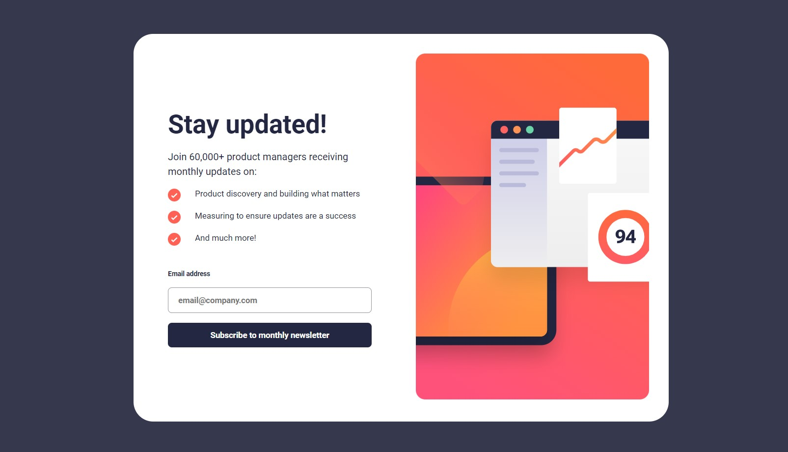

# Newsletter sign-up form with success message

This is my solution to the [Newsletter sign-up form with success message challenge on Frontend Mentor](https://www.frontendmentor.io/challenges/newsletter-signup-form-with-success-message-3FC1AZbNrv). 

## Table of contents

- [Overview](#overview)
  - [The challenge](#the-challenge)
  - [Screenshot](#screenshot)
  - [Links](#links)
- [My process](#my-process)
  - [Built with](#built-with)
  - [What I learned](#what-i-learned)
- [Author](#author)


## Overview

### The challenge

Users should be able to:

- Add their email and submit the form
- See a success message with their email after successfully submitting the form
- See form validation messages if:
  - The field is left empty
  - The email address is not formatted correctly
- View the optimal layout for the interface depending on their device's screen size
- See hover and focus states for all interactive elements on the page

### Screenshot



### Links

- Solution URL: [solution URL](https://www.frontendmentor.io/solutions/newsletter-signup-success-with-typescript-and-gsap-RKdK93iIw2)
- Live Site URL: [live site URL](https://newsletter-signup-o.netlify.app/)

## My process

### Built with

- Semantic HTML5 markup
- CSS custom properties
- Flexbox
- Typescript
- [React](https://reactjs.org/) - JS library


### What I learned

Typescript basics


```js
const checkEmailInput=(email:string) : boolean=>{
    const emailValidation = /^\w+([\.-]?\w+)*@\w+([\.-]?\w+)*(\.\w{2,3})+$/;
    if (email.length === 0 || (emailValidation.test(email))===false || !email) {
        return  false;
    } 
    else {
        return true
        
    }
}
```

## Author

- Website - [Osaaroh](https://osaaroh.vercel.app/)
- Frontend Mentor - [@osaaroh](https://www.frontendmentor.io/profile/osaaroh)

